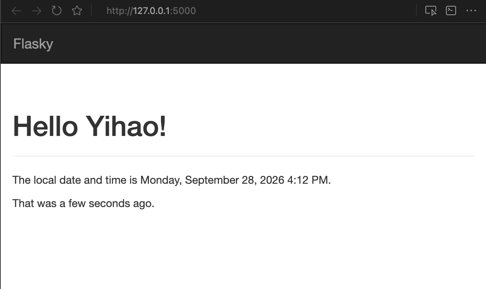
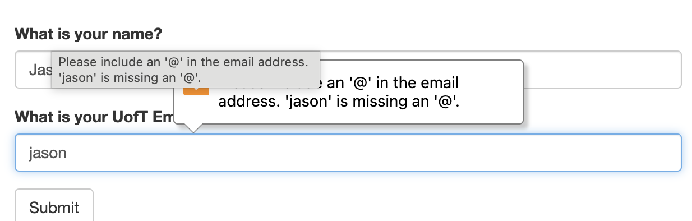
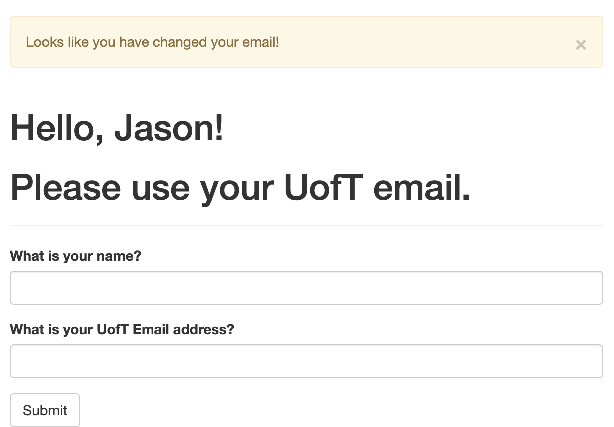
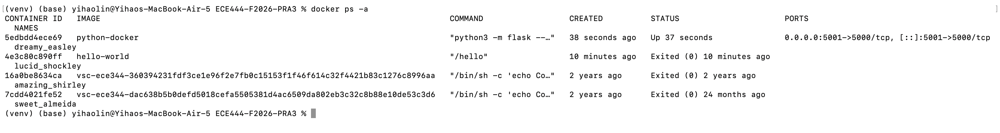

**Yihao (Jason) Lin**

This repo is a clone of https://github.com/miguelgrinberg/flasky

## Activity 1.3



## Activity 1.4

Step 4: an email without an "@" is rejected by the browser before the form is submitted.



Step 5: a non-UofT email shows the "Please use your UofT email." reminder.



## Activity 2.4

The app is built and run with Docker. Port 5000 on my Mac is used by AirPlay Receiver, so the container's port 5000 is published on host port 5001 and the app is at http://localhost:5001.

```bash
docker build -t python-docker .
docker run -d -p 5001:5000 python-docker
docker ps -a
```

